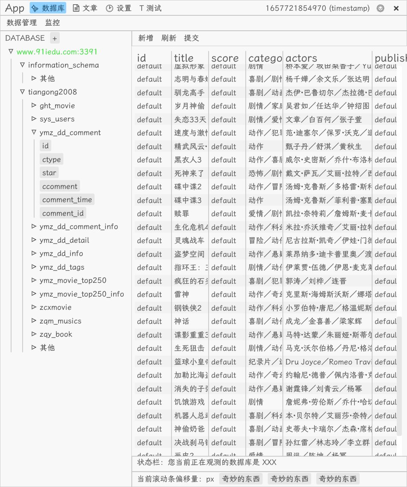

# 代号：NCDG-RS

## 图示

| 日期 | 示例 |
|------|-------|
| 2022-05 ||

## 任务清单

- [ ] 启动时自动连接，自动加载数据表
  - [x] 保存并加载数据库连接配置
  - [ ] 自动加载数据库？
  - [ ] 自动加载数据表？
  - [ ] 自动加载所有字段？
- [ ] 优化设置界面
- [ ] 优化黑暗模式下的配色
- [ ] 优化侧边栏样式
- [ ] 双击编辑不能直接获取输入框焦点
- [ ] 右键菜单不能自动关闭
- [ ] 自定义 SQL 下禁用常规操作 (可选：保留分页功能)
- [ ] 提示框 (日志管理)

- [x] 解决 Option 类型解析 / 渲染
- [x] 解决主键检查
- [x] 解决插入

## bug

- [ ] 插入时间类型，类型转换失败
  - 原因：输入格式不符合 FromStr 实现
  - 解决：优化用户输入提示

## V2

- [ ] 加入 Redis 支持

## Idea

- [ ] 丰富文章页面功能
- [ ] MarkDown 解析
